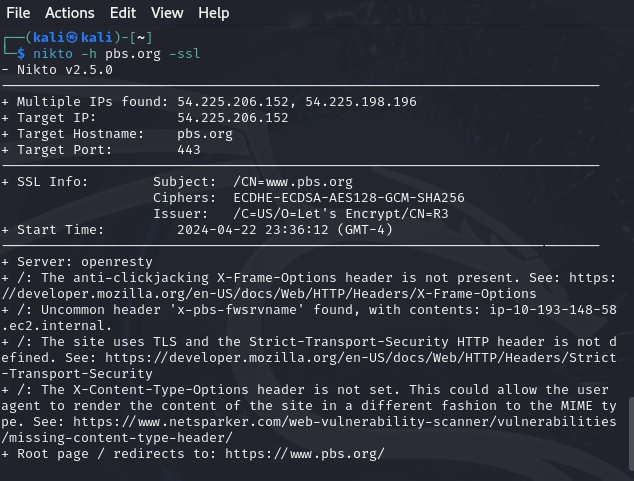
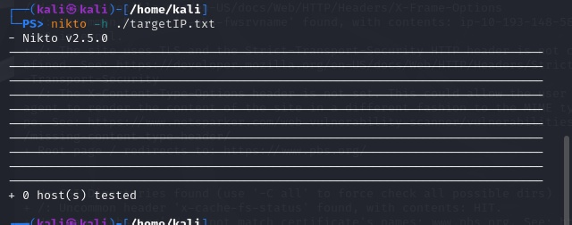
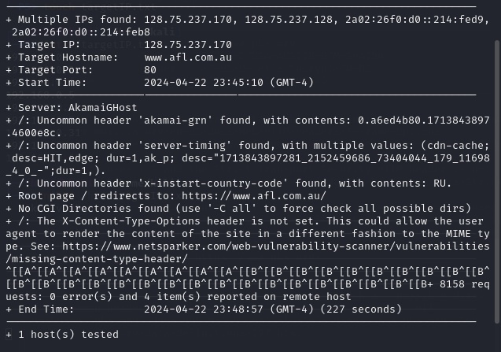

---
## Front matter
title: "Индивидуальный проект"
subtitle: "Этап 4. Использование nikto"
author: "Шуваев Сергей Александрович"

## Generic otions
lang: ru-RU
toc-title: "Содержание"

## Bibliography
bibliography: bib/cite.bib
csl: pandoc/csl/gost-r-7-0-5-2008-numeric.csl

## Pdf output format
toc: true # Table of contents
toc-depth: 2
lof: true # List of figures
lot: true # List of tables
fontsize: 12pt
linestretch: 1.5
papersize: a4
documentclass: scrreprt
## I18n polyglossia
polyglossia-lang:
  name: russian
  options:
	- spelling=modern
	- babelshorthands=true
polyglossia-otherlangs:
  name: english
## I18n babel
babel-lang: russian
babel-otherlangs: english
## Fonts
mainfont: PT Serif
romanfont: PT Serif
sansfont: PT Sans
monofont: PT Mono
mainfontoptions: Ligatures=TeX
romanfontoptions: Ligatures=TeX
sansfontoptions: Ligatures=TeX,Scale=MatchLowercase
monofontoptions: Scale=MatchLowercase,Scale=0.9
## Biblatex
biblatex: true
biblio-style: "gost-numeric"
biblatexoptions:
  - parentracker=true
  - backend=biber
  - hyperref=auto
  - language=auto
  - autolang=other*
  - citestyle=gost-numeric
## Pandoc-crossref LaTeX customization
figureTitle: "Рис."
tableTitle: "Таблица"
listingTitle: "Листинг"
lofTitle: "Список иллюстраций"
lotTitle: "Список таблиц"
lolTitle: "Листинги"
## Misc options
indent: true
header-includes:
  - \usepackage{indentfirst}
  - \usepackage{float} # keep figures where there are in the text
  - \floatplacement{figure}{H} # keep figures where there are in the text
---

# Цель работы

Научиться использовать nikto для сканирования сайтов на уязвимости

# Теоритическое введение

nikto — базовый сканер безопасности веб-сервера. Он сканирует и обнаруживает уязвимости в веб-приложениях, обычно вызванные неправильной конфигурацией на самом сервере, файлами, установленными по умолчанию, и небезопасными файлами, а также устаревшими серверными приложениями. Несмотря на то, что этот инструмент чрезвычайно эффективен, он не действует скрытно. Любой сайт с системой обнаружения вторжений или иными мерами безопасности поймет, что его сканируют. Nikto был разработан для тестирования безопасности и о скрытности его работы никто не задумывался.


# Выполнение этапа проекта

Сначала проверяю установку nikto командой ```nikto -HELP``` и получаю справку всех имеющихся команд, что говорит о наличии nikto на машине.

# Сканирование сайта с SSl

Я пробую сканировать сайт pbs.org. Использую команду ```nikto -h pbs.org -ssl```
Получаю резултат:

{#fig:001 width=70%}

# Cканирование IP-адреса

Теперь, когда мы провели быстрое сканирование веб-сайта, мы можем попробовать использовать Nikto в локальной сети, чтобы найти embedded-сервера, такие как страница логина роутера или HTTP-сервис на другой машине, который представляет из себя просто сервер без веб-сайта. Чтобы узнать IP-адрес мы будем использовать ifconfig.

{#fig:002 width=70%}

Cоздаю файл targetIP.txt командой touch и просматриваю его содержиимое через cat

{#fig:003 width=70%}

Начинаю сканировать список IP-адресов с помощью команды ```nikto -h targetIP.txt```
Результатов никаких не получено почему-то. Скорее всего из-за того, что не использовад ipcalc, а его устновить нельзя.

{#fig:004 width=70%}

# Сканирование HTTP-сайта

До этого мы сканировали защищенный сайт, а теперь просканиуем незащищенны, который работает на 80-м порту. Используем команду ```nikto -h www.afl.com.au```. И через какое-то время получаем результат.

{#fig:004 width=70%}


# Вывод

Я научился использовать nikto для сканирования защищенных и незащищенных сайтов на уязвимости, и научился также получать дополнительную информацию из nikto.